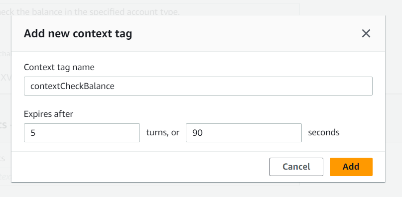
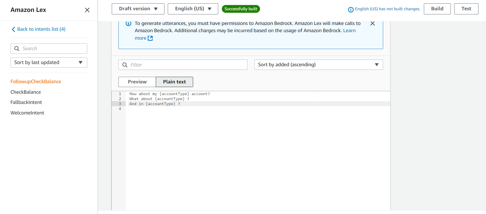
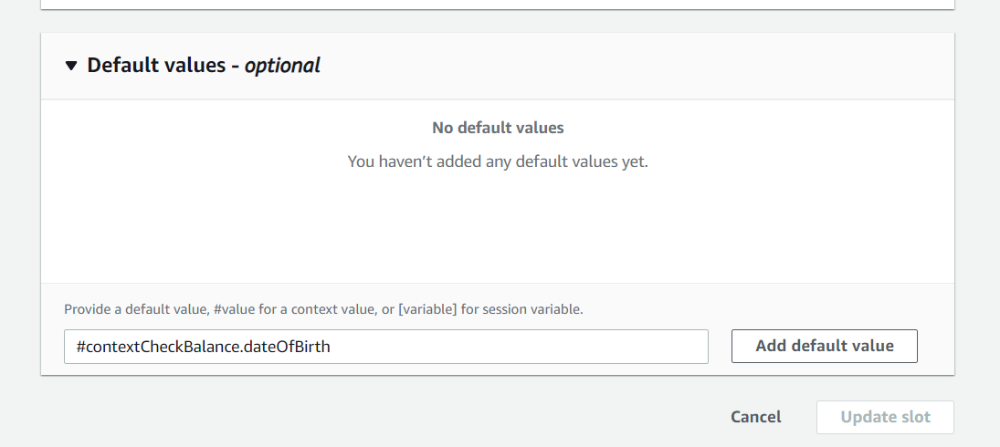
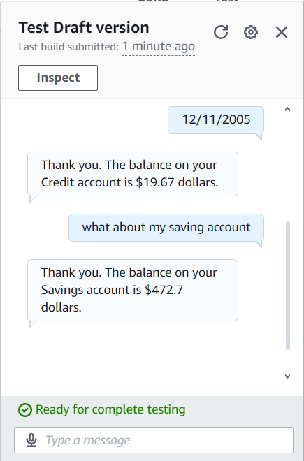

<h1>Save user info with your Chatbot(4)</h1>

<h2>Description</h2>
 Amazon Lex is a fully managed service by AWS for building conversational interfaces into applications using voice and text. It uses automatic speech recognition (ASR) to convert speech to text and natural language understanding (NLU)
<br />

<h2>  How I used Amazon Lex in this project </h2>
I used Amazon lex to creat a context tag that will help the chatbot to remember
previous data requested by customer so as to prevent the chatbot from asking
 similar questons.
<h2>Skills Demostrated:</h2>

- <b>Cloud Computing Proficiency: Configuring AWS services like IAM, Lambda, and Amazon Lex to build and manage conversational interfaces</b> 
- <b>Natural Language Understanding (NLU): Designing intents, utterances, and slot types to enable the chatbot to comprehend and respond effectively to user queries.</b>
- <b>Problem-Solving with Lambda: Developing and deploying AWS Lambda functions for custom business logic and advanced intent fulfillment..</b>

<h2>Utilities used</h2>
<ul>
  <li>AWS console</li>
   <li>Amazon Lex</li>
</ul>
<h2>Program walk-through:</h2>

<p align="center">
 <br />
 Context Tags:
 Context tags are used to store and check for specific information across
 different parts of a conversation. They help save the user from having to repeat
 certain information
 There are two types of context tags:output context tags and input context tags
 I created a context tag called contextCheckBalance This context tag was
 created in the intent CheckBalance This tag stores information about'
 customers data
  <br/>

<br />
 FollowUpCheckBalance
 I created a new intent called FollowupCheckBalance. The purpose of this intent
 is to let the user check another's balance without having to provide their date of
 birth again
 This intent is connected to the previous intent I made, CheckBalance, because'
 FollowUpCheckbalance will only get triggered after the user has checked their  balance once already <br/>
 
<br />
 
<br />
 Input Context Tag:
 I created an input context, contextCheckBalance, that' is using the exact same
 tag as the output context tag i've set up in the CheckBalance intent.
  <br/>

<br />

<br />
 The final result!
 To see the context tags and followup intent in action, I' first triggered the
 CheckBalance intent then i followed up with the utterance "what about
 savings"to trigger FollowUpCheckBalance.
 If I had gone straight to trying to trigger FollowUpCheckBalance without setting
 up any context'my chatbot will not have the context needed to fulfill the
 conversation.As a result,it will return the Fallbackintent.<br/>

<br />
</p>

<!--
 ```diff
- text in red
+ text in green
! text in orange
# text in gray
@@ text in purple (and bold)@@
```
--!>
